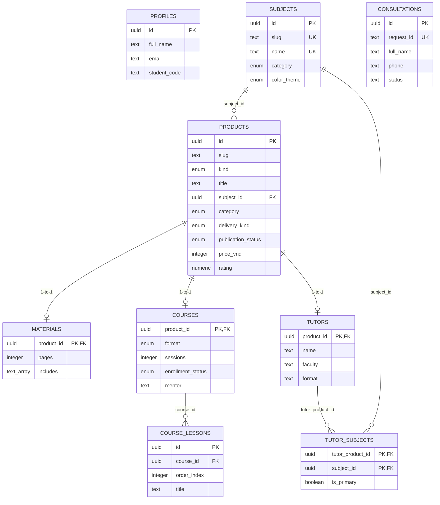

# Database Architecture & Migration Guide — LEFT HAND

This document outlines the PostgreSQL database schema for the LEFT HAND learning platform, designed for Supabase.

> [!NOTE]
> **Status:** Topological migrations `0001_core_schema.sql` through `0009_consultation_updated_by.sql` and idempotent `supabase/seed.sql` are prepared locally and verified via automated contract checks. They have **NOT** yet been applied to the hosted Supabase project.

---

## 1. Table Responsibilities

The schema employs a normalized, typed relational model separating core product identity from specialized format metadata:

| Table | Primary Key | Description |
| :--- | :--- | :--- |
| `profiles` | `id` (UUID) | User account profile data (full name, email, phone, faculty, student code, avatar). Anchors future authentication. |
| `subjects` | `id` (UUID) | Canonical academic subjects (e.g. *Kế toán tài chính 1*, *Xác suất thống kê*). |
| `products` | `id` (UUID) | Base catalog entity for all offerings (`material`, `course`, `tutor`). Stores slugs, titles, categories, publication status, integer VND pricing, and review ratings. |
| `materials` | `product_id` (UUID FK) | 1-to-1 extension of `products` for study guides, PDFs, and formula cheat-sheets (page counts, tags, deliverables, target audience). |
| `courses` | `product_id` (UUID FK) | 1-to-1 extension of `products` for live review classes and video courses (format, session count, schedule, mentor, syllabus, enrollment status). |
| `course_lessons` | `id` (UUID) | 1-to-N lessons / syllabus items under a specific course (order index, lesson title, duration). |
| `tutors` | `product_id` (UUID FK) | 1-to-1 extension of `products` for 1-on-1 and small group peer tutors (name, faculty, format description, strengths, bio). |
| `tutor_subjects` | `(tutor_product_id, subject_id)` | M-to-N join table tracking which subjects each tutor teaches and whether a subject is their primary specialization. |
| `consultations` | `id` (UUID) | Consultation lead capture. Tracks requests for advice/quotes (status, requester info, requested item). |

---

## 2. Key Relational Diagrams



---

## 3. Status Models & Pricing Integrity

### Publication vs. Availability Lifecycle
- **`publication_status`** (`draft`, `published`, `archived`) lives on `products` and controls catalog visibility.
- **`enrollment_status`** (`open`, `coming-soon`, `full`) lives on `courses` (and future tutoring capacity) and governs registration capability.

### Pricing Rules (Integer Minor Units in VND)
- `price_vnd` stores non-negative integer amounts (e.g. `29000`, `149000`).
- No fractional cents or formatted strings (`29.000đ`) are stored in the database.
- Contact pricing is enforced via `is_contact_for_price = true` with `price_vnd IS NULL` via check constraint `chk_pricing_consistency`.

---

## 4. Security & Row Level Security (RLS) Policy

- **Supabase Auth Integration:** `profiles.id` is explicitly anchored to `auth.users(id)` with `ON DELETE CASCADE`. No detached or unauthenticated profile records can exist.
- **RLS Enabled:** All 8 application tables (`profiles`, `subjects`, `products`, `materials`, `courses`, `course_lessons`, `tutors`, `tutor_subjects`) have `ROW LEVEL SECURITY` enabled by default.
- **Public Catalog Read Access (`0002_public_catalog_read_policies.sql` & `0003_public_catalog_table_grants.sql`):**
  - Schema `USAGE` on `public` and table-level `SELECT` privileges are granted to `anon` and `authenticated` roles for catalog tables (`subjects`, `products`, `materials`, `courses`, `course_lessons`, `tutors`, `tutor_subjects`).
  - Public anonymous (`anon`) and authenticated (`authenticated`) users can query catalog items through Row Level Security.
  - Public users may read only published content (`publication_status = 'published'`).
  - Child tables (`materials`, `courses`, `course_lessons`, `tutors`, `tutor_subjects`) restrict reads to items whose parent product is published.
  - User profiles remain strictly private with no public table grants or policies.
- **Consultation Form Insert Security (`0006_consultations.sql`):**
  - Consultation leads (`consultations`) allow restricted public `INSERT` (anon, authenticated) only on specific safe form columns. Database-managed fields (id, status, timestamps) cannot be written by clients.
  - Canonical status constraint `chk_consultations_status` enforces exactly `'new'`, `'contacted'`, `'qualified'`, and `'closed'`.
- **Consultation Admin Read Access (`0007_consultation_admin_rls.sql`):**
  - Consultation read access (`SELECT`) is strictly granted only to authenticated users whose profile `role` is `'admin'`. Anonymous, student, and tutor roles are explicitly denied read access.
- **Consultation Admin Status Update Hardening (`0008_consultation_admin_status_update.sql` / Task 4.2-E-A):**
  - **Rejection of Table-wide UPDATE Grants:** Table-wide `GRANT UPDATE ON TABLE consultations` is strictly rejected for all roles. Migration 0008 explicitly revokes table-wide `UPDATE` from `anon` and `authenticated`.
  - **Strict Mutation Grant Restriction:** The sole permitted grant in migration 0008 is `GRANT UPDATE (status) ON TABLE consultations TO authenticated;`. Grants of `SELECT`, `INSERT`, `DELETE`, or `ALL` (both table-wide and column-level) are forbidden.
  - **Privilege Escalation & RLS Bypass Safeguards:** Migration 0008 contains no references to `service_role`, hardcoded secrets/tokens/credentials, `SECURITY DEFINER`, `BYPASSRLS`, `SET ROLE`, or `ALTER ROLE`. RLS disabling and altering unrelated tables are strictly rejected.
  - **Status Integrity Contract:** Migration 0008 does not introduce secondary status types, enums, checks, or constraints. The canonical status constraint remains `chk_consultations_status` defined in migration 0006.
  - **Trigger Contract:** Trigger `trg_consultations_updated_at` targets `consultations` before update for each row and executes the established `update_updated_at_column()` function from migration 0004 without defining a replacement or using `SECURITY DEFINER`.
  - **Dual-Predicate Admin RLS Policy:** Exactly one UPDATE policy (`consultations_allow_update_status_admin`) is created, targeting `authenticated`. Both `USING` and `WITH CHECK` clauses require `EXISTS (SELECT 1 FROM public.profiles WHERE profiles.id = auth.uid() AND profiles.role = 'admin')`. No DELETE policy or grants exist.
- **Consultation Updater Audit Trail (`0009_consultation_updated_by.sql`):** `consultations.updated_by` is a nullable UUID reference to `auth.users(id)` with `ON DELETE SET NULL`. A dedicated database `BEFORE UPDATE` trigger assigns it from `auth.uid()`, so the client cannot choose the updater identity. The existing `0008` trigger continues to manage `updated_at`.

---

## 5. How to Run Migrations and Seed Later

When ready to apply to local or hosted Supabase:

### Using Supabase CLI:
```bash
# 1. Start local Supabase instance
npx supabase start

# 2. Apply migrations
npx supabase migration up

# 3. Seed database
npx supabase db reset # (or run psql against supabase/seed.sql)
```

### Using psql / direct connection:
```bash
psql -h <SUPABASE_DB_HOST> -U postgres -d postgres -f supabase/migrations/0001_core_schema.sql
psql -h <SUPABASE_DB_HOST> -U postgres -d postgres -f supabase/migrations/0002_public_catalog_read_policies.sql
psql -h <SUPABASE_DB_HOST> -U postgres -d postgres -f supabase/migrations/0003_public_catalog_table_grants.sql
psql -h <SUPABASE_DB_HOST> -U postgres -d postgres -f supabase/migrations/0004_profiles_schema_and_policies.sql
psql -h <SUPABASE_DB_HOST> -U postgres -d postgres -f supabase/migrations/0005_account_approval_gate.sql
psql -h <SUPABASE_DB_HOST> -U postgres -d postgres -f supabase/migrations/0006_consultations.sql
psql -h <SUPABASE_DB_HOST> -U postgres -d postgres -f supabase/migrations/0007_consultation_admin_rls.sql
psql -h <SUPABASE_DB_HOST> -U postgres -d postgres -f supabase/migrations/0008_consultation_admin_status_update.sql
psql -h <SUPABASE_DB_HOST> -U postgres -d postgres -f supabase/migrations/0009_consultation_updated_by.sql
psql -h <SUPABASE_DB_HOST> -U postgres -d postgres -f supabase/seed.sql
```

> [!IMPORTANT]
> The seed script `supabase/seed.sql` is fully idempotent using `ON CONFLICT (...) DO UPDATE` and can be executed repeatedly without generating duplicate records.
