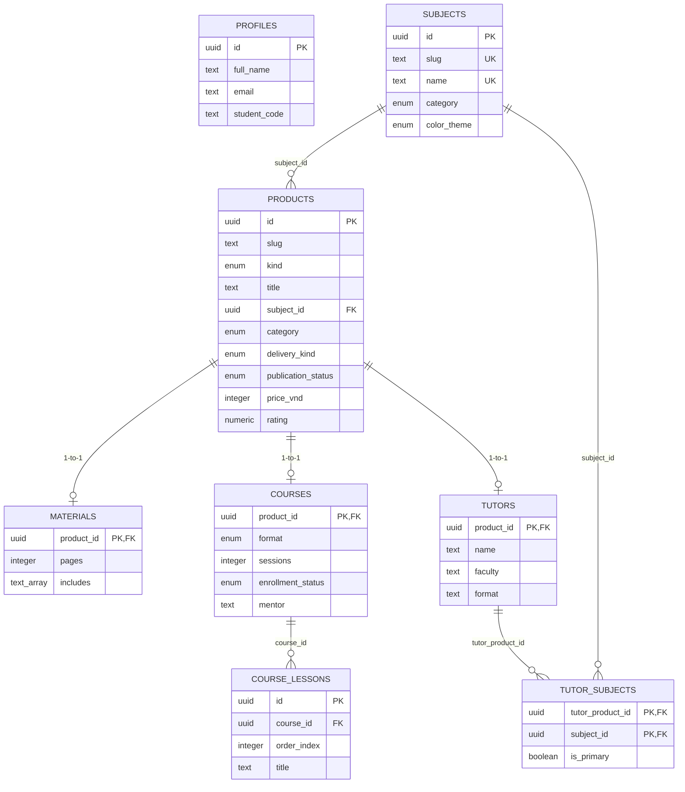

# Database Architecture & Migration Guide — LEFT HAND

This document outlines the PostgreSQL database schema for the LEFT HAND learning platform, designed for Supabase.

> [!NOTE]
> **Status:** Initial migration files (`supabase/migrations/0001_core_schema.sql` and `supabase/seed.sql`) are prepared locally and have **NOT** yet been applied to the hosted Supabase project.

---

## 1. Table Responsibilities

The schema employs a normalized, typed relational model separating core product identity from specialized format metadata:

| Table | Primary Key | Description |
| :--- | :--- | :--- |
| `profiles` | `id` (UUID) | User account profile data (full name, email, phone, faculty, student code, avatar). Anchors future authentication. |
| `subjects` | `id` (UUID) | Canonical academic subjects (e.g. *Kế toán tài chính 1*, *Xác suất thống kê*). |
| `products` | `id` (UUID) | Base catalog entity for all offerings (`material`, `course`, `tutor`). Stores slugs, titles, categories, publication status, integer VND pricing, and review ratings. |
| `materials` | `product_id` (UUID FK) | 1-to-1 extension of `products` for study guides, PDFs, and formula cheat-sheets (page counts, tags, deliverables, target audience). |
| `courses` | `product_id` (UUID FK) | 1-to-1 extension of `products` for live review classes and video courses (format, session count, schedule, mentor, syllabus, enrollment status). |
| `course_lessons` | `id` (UUID) | 1-to-N lessons / syllabus items under a specific course (order index, lesson title, duration). |
| `tutors` | `product_id` (UUID FK) | 1-to-1 extension of `products` for 1-on-1 and small group peer tutors (name, faculty, format description, strengths, bio). |
| `tutor_subjects` | `(tutor_product_id, subject_id)` | M-to-N join table tracking which subjects each tutor teaches and whether a subject is their primary specialization. |

---

## 2. Key Relational Diagrams



---

## 3. Status Models & Pricing Integrity

### Publication vs. Availability Lifecycle
- **`publication_status`** (`draft`, `published`, `archived`) lives on `products` and controls catalog visibility.
- **`enrollment_status`** (`open`, `coming-soon`, `full`) lives on `courses` (and future tutoring capacity) and governs registration capability.

### Pricing Rules (Integer Minor Units in VND)
- `price_vnd` stores non-negative integer amounts (e.g. `29000`, `149000`).
- No fractional cents or formatted strings (`29.000đ`) are stored in the database.
- Contact pricing is enforced via `is_contact_for_price = true` with `price_vnd IS NULL` via check constraint `chk_pricing_consistency`.

## 4. Security & Row Level Security (RLS) Policy

- **Supabase Auth Integration:** `profiles.id` is explicitly anchored to `auth.users(id)` with `ON DELETE CASCADE`. No detached or unauthenticated profile records can exist.
- **RLS Enabled:** All 8 application tables (`profiles`, `subjects`, `products`, `materials`, `courses`, `course_lessons`, `tutors`, `tutor_subjects`) have `ROW LEVEL SECURITY` enabled by default.
- **Public Catalog Read Access (`0002_public_catalog_read_policies.sql`):**
  - Public anonymous (`anon`) and authenticated (`authenticated`) users can query catalog items using safe SELECT policies.
  - Public users may read only published content (`publication_status = 'published'`).
  - Child tables (`materials`, `courses`, `course_lessons`, `tutors`, `tutor_subjects`) restrict reads to items whose parent product is published.
  - User profiles remain strictly private and protected under default RLS denial until authenticated profile policies are added.
  - No public mutation (INSERT, UPDATE, DELETE) policies are permitted.

---

## 5. How to Run Migrations and Seed Later

When ready to apply to local or hosted Supabase:

### Using Supabase CLI:
```bash
# 1. Start local Supabase instance
npx supabase start

# 2. Apply migrations
npx supabase migration up

# 3. Seed database
npx supabase db reset # (or run psql against supabase/seed.sql)
```

### Using psql / direct connection:
```bash
psql -h <SUPABASE_DB_HOST> -U postgres -d postgres -f supabase/migrations/0001_core_schema.sql
psql -h <SUPABASE_DB_HOST> -U postgres -d postgres -f supabase/migrations/0002_public_catalog_read_policies.sql
psql -h <SUPABASE_DB_HOST> -U postgres -d postgres -f supabase/seed.sql
```

> [!IMPORTANT]
> The seed script `supabase/seed.sql` is fully idempotent using `ON CONFLICT (...) DO UPDATE` and can be executed repeatedly without generating duplicate records.

