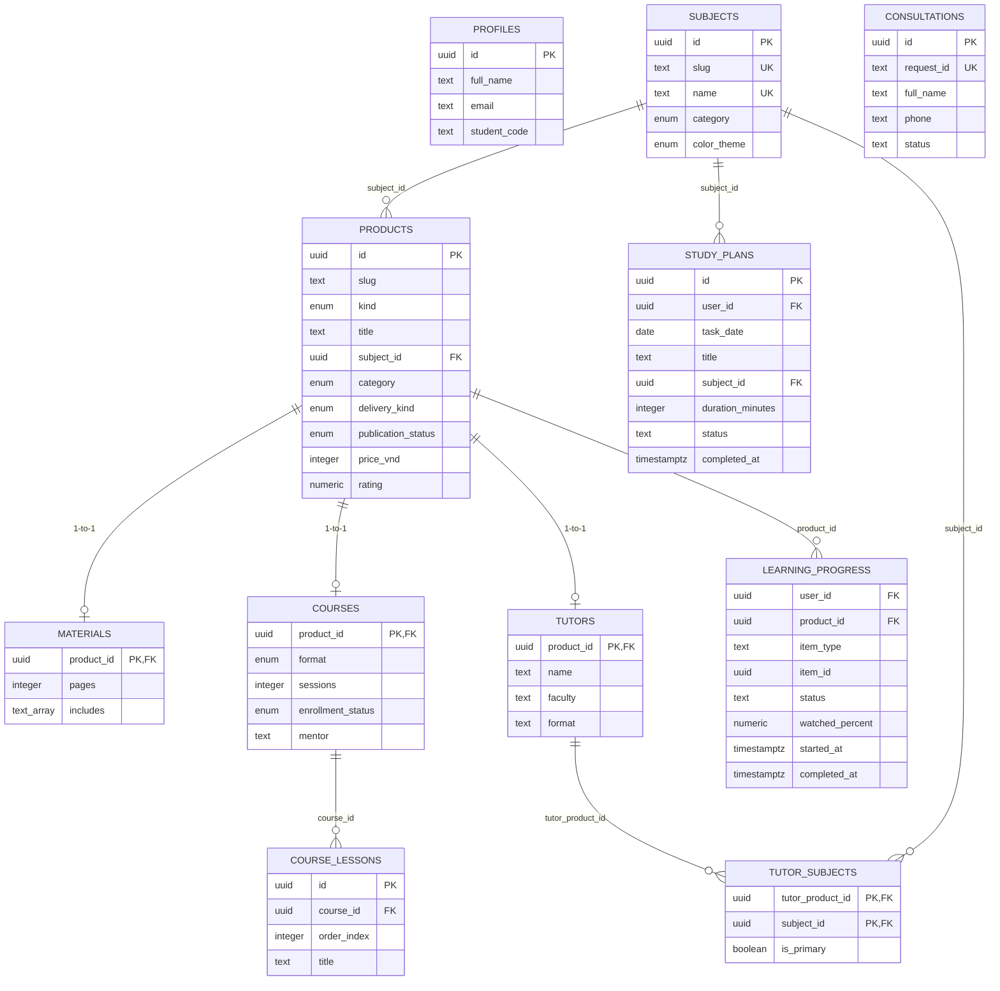

# Database Architecture & Migration Guide — LEFT HAND

This document outlines the PostgreSQL database schema for the LEFT HAND learning platform, designed for Supabase.

> [!NOTE]
> **Status:** Migrations `0001_core_schema.sql` through `0017_profile_on_auth_signup.sql` are already applied and content-locked. Migrations `0018_catalog_semantic_invariants.sql` through `0026_consultation_intake_access_boundary.sql` are prepared locally and verified via automated contract checks; hosted migration state must be checked before applying them.

---

## 1. Table Responsibilities

The schema employs a normalized, typed relational model separating core product identity from specialized format metadata:

| Table | Primary / Unique Key | Description |
| :--- | :--- | :--- |
| `profiles` | `id` (UUID) | User account profile data (full name, email, phone, faculty, student code, avatar). Anchors future authentication. |
| `subjects` | `id` (UUID) | Canonical academic subjects (e.g. *Kế toán tài chính 1*, *Xác suất thống kê*). |
| `products` | `id` (UUID) | Base catalog entity for all offerings (`material`, `course`, `tutor`). Stores slugs, titles, categories, publication status, integer VND pricing, and review ratings. |
| `materials` | `product_id` (UUID FK) | 1-to-1 extension of `products` for study guides, PDFs, and formula cheat-sheets (page counts, tags, deliverables, target audience). |
| `material_assets` | `id` (UUID) | Immutable metadata for each private PDF/video version uploaded for a material product. |
| `product_entitlements` | `id` (UUID) | One user-to-product entitlement source row with active, revoked, or expired lifecycle state. |
| `learning_progress` | Unique `(user_id, product_id, item_type, item_id)` | Student-owned progress for entitled material and lesson items, with bounded watch percentage and lifecycle timestamps. |
| `study_plans` | `id` (UUID) | Student-owned daily study tasks and diary entries, keyed by the learner and their local calendar date. |
| `courses` | `product_id` (UUID FK) | 1-to-1 extension of `products` for live review classes and video courses (format, session count, schedule, mentor, syllabus, enrollment status). |
| `course_lessons` | `id` (UUID) | 1-to-N lessons / syllabus items under a specific course (order index, lesson title, duration). |
| `tutors` | `product_id` (UUID FK) | 1-to-1 extension of `products` for 1-on-1 and small group peer tutors (name, faculty, format description, strengths, bio). |
| `tutor_subjects` | `(tutor_product_id, subject_id)` | M-to-N join table tracking which subjects each tutor teaches and whether a subject is their primary specialization. |
| `consultations` | `id` (UUID) | Consultation lead capture. Tracks requests for advice/quotes (status, requester info, requested item, and optimistic-concurrency version). |
| `consultation_status_history` | `id` (UUID) | Append-only forward status transitions with database-managed actor, timestamp, and version. |

---

## 2. Key Relational Diagrams



---

## 3. Status Models & Pricing Integrity

### Publication vs. Availability Lifecycle
- **`publication_status`** (`draft`, `published`, `archived`) lives on `products` and controls catalog visibility.
- **`enrollment_status`** (`open`, `coming-soon`, `full`) lives on `courses` (and future tutoring capacity) and governs registration capability.

### Pricing Rules (Integer Minor Units in VND)
- `price_vnd` stores non-negative integer amounts (e.g. `29000`, `149000`).
- No fractional cents or formatted strings (`29.000đ`) are stored in the database.
- Contact pricing is enforced via `is_contact_for_price = true` with `price_vnd IS NULL` via check constraint `chk_pricing_consistency`.

### Catalog semantic invariants (`0018_catalog_semantic_invariants.sql`)

- A product's `category` and `color_theme` must match its subject and the canonical category/theme mapping.
- `materials`, `courses`, and `tutors` can only extend products of their matching `kind`.
- `old_price_vnd` is nullable, but when present it must be at least `price_vnd`; contact-price products cannot carry an original price.
- `tutors.format` is restricted to the canonical `TUTOR_FORMATS` set, and `tutor_subjects` has at most one primary subject through a partial unique index. The typed repository rejects published tutors without exactly one primary subject before rendering.
- Trigger helpers are `SECURITY INVOKER`, use a fixed `search_path = public`, perform no out-of-scope DML, and do not change RLS grants or policies.
- The seed is transactional and updates every product semantic field on conflict, so reruns reconcile stale category, subject, theme, delivery, publication, pricing, rating, and hot flags.

### Atomic admin catalog mutations (`0019_admin_catalog_transaction_rpc.sql`)

- Admin product and child create/update/delete operations use one typed `admin_catalog_mutate` RPC transaction; child failures abort the product mutation and product deletes cascade to their child row.
- The RPC checks an approved admin in `public.profiles`, uses fixed SQL (no dynamic SQL or privileged role bypass), and deliberately omits `products.kind` from update payloads.
- A database trigger rejects any attempted product-kind change. Public child policies also require both the matching parent kind and `publication_status = 'published'`.

### Mutation access boundary (`0020_catalog_mutation_access_boundary.sql`)

- `authenticated` retains only public `SELECT` privileges on `products`, `materials`, `courses`, and `tutors`; direct table `INSERT`, `UPDATE`, and `DELETE` privileges and the old direct-admin mutation policies are removed.
- Approved authenticated admins use only `admin_catalog_mutate_atomic`, which delegates to the fixed typed RPC inside the same database transaction. Anonymous and public execution are revoked.

### Normalized catalog search (`0021_catalog_search_normalization.sql`)

- `products.search_document` and `subjects.search_document` store one database-normalized search document covering product slug, title, description, and subject identity.
- The `unaccent`/trigram-backed search columns are maintained by fixed triggers and queried server-side; product and subject updates keep the documents synchronized.

---

## 4. Security & Row Level Security (RLS) Policy

- **Supabase Auth Integration:** `profiles.id` is explicitly anchored to `auth.users(id)` with `ON DELETE CASCADE`. No detached or unauthenticated profile records can exist.
- **RLS Enabled:** All application tables have `ROW LEVEL SECURITY` enabled. Catalog reads, profiles, entitlements, private-material metadata, and learning progress each have separate policies.
- **Public Catalog Read Access (`0002_public_catalog_read_policies.sql` & `0003_public_catalog_table_grants.sql`):**
  - Schema `USAGE` on `public` and table-level `SELECT` privileges are granted to `anon` and `authenticated` roles for catalog tables (`subjects`, `products`, `materials`, `courses`, `course_lessons`, `tutors`, `tutor_subjects`).
  - Public anonymous (`anon`) and authenticated (`authenticated`) users can query catalog items through Row Level Security.
  - Public users may read only published content (`publication_status = 'published'`).
  - Child tables (`materials`, `courses`, `course_lessons`, `tutors`, `tutor_subjects`) restrict reads to items whose parent product is published.
  - User profiles remain strictly private with no public table grants or policies.
- **Consultation Form Insert Security (`0006_consultations.sql`, superseded for writes by `0026`):**
  - Migration 0006 originally allowed restricted public `INSERT`; migration 0026 revokes that table privilege and drops its permissive INSERT policy without altering historical migration content.
  - Canonical status constraint `chk_consultations_status` enforces exactly `'new'`, `'contacted'`, `'qualified'`, and `'closed'`.
- **Consultation Admin Read Access (`0007_consultation_admin_rls.sql`):**
  - Consultation read access (`SELECT`) is strictly granted only to authenticated users whose profile `role` is `'admin'`. Anonymous, student, and tutor roles are explicitly denied read access.
- **Consultation Admin Status Update Hardening (`0008_consultation_admin_status_update.sql` / Task 4.2-E-A):**
  - **Rejection of Table-wide UPDATE Grants:** Table-wide `GRANT UPDATE ON TABLE consultations` is strictly rejected for all roles. Migration 0008 explicitly revokes table-wide `UPDATE` from `anon` and `authenticated`.
  - **Strict Mutation Grant Restriction:** The sole permitted grant in migration 0008 is `GRANT UPDATE (status) ON TABLE consultations TO authenticated;`. Grants of `SELECT`, `INSERT`, `DELETE`, or `ALL` (both table-wide and column-level) are forbidden.
  - **Privilege Escalation & RLS Bypass Safeguards:** Migration 0008 contains no references to `service_role`, hardcoded secrets/tokens/credentials, `SECURITY DEFINER`, `BYPASSRLS`, `SET ROLE`, or `ALTER ROLE`. RLS disabling and altering unrelated tables are strictly rejected.
  - **Status Integrity Contract:** Migration 0008 does not introduce secondary status types, enums, checks, or constraints. The canonical status constraint remains `chk_consultations_status` defined in migration 0006.
  - **Trigger Contract:** Trigger `trg_consultations_updated_at` targets `consultations` before update for each row and executes the established `update_updated_at_column()` function from migration 0004 without defining a replacement or using `SECURITY DEFINER`.
  - **Dual-Predicate Admin RLS Policy:** Exactly one UPDATE policy (`consultations_allow_update_status_admin`) is created, targeting `authenticated`. Both `USING` and `WITH CHECK` clauses require `EXISTS (SELECT 1 FROM public.profiles WHERE profiles.id = auth.uid() AND profiles.role = 'admin')`. No DELETE policy or grants exist.
- **Consultation Updater Audit Trail (`0009_consultation_updated_by.sql`):** `consultations.updated_by` is a nullable UUID reference to `auth.users(id)` with `ON DELETE SET NULL`. A dedicated database `BEFORE UPDATE` trigger assigns it from `auth.uid()`, so the client cannot choose the updater identity. The existing `0008` trigger continues to manage `updated_at`.
- **Consultation Workflow Hardening (`0024_consultation_workflow_hardening.sql`):** approved admins may move a consultation only forward (`new → contacted → qualified → closed`); same-state retries are idempotent, while backward/reopen transitions are rejected by the database trigger. `consultations.version` is incremented atomically and required in the repository update predicate. Each real transition inserts one append-only `consultation_status_history` row in the same transaction, with `old_status`, `new_status`, `auth.uid()`, server time, and version. History is readable only by approved admins; update/delete/insert grants are absent and mutation triggers reject tampering.
- **Consultation Workflow Trigger Cleanup (`0025_consultation_workflow_trigger_order.sql`):** removes only the legacy consultation `updated_at`/`updated_by` triggers from `0008`/`0009`, so the `0024` workflow trigger is the sole owner of audit fields. This preserves the immutable earlier migrations and makes same-state retries true no-ops.
- **Consultation Intake Access Boundary (`0026_consultation_intake_access_boundary.sql`):** direct `INSERT` is revoked from `anon` and `authenticated`; the only public mutation surface is the fixed-signature `submit_consultation_intake` RPC. The `SECURITY DEFINER` function uses a fixed `pg_catalog, public` search path, checks exact input fields/lengths/phone format, stores only an allowlisted internal pathname, resolves subject-only requests directly from `subjects`, and requires any product to be uniquely published and bound to the selected subject. It uses `ON CONFLICT (request_id) DO NOTHING` for idempotency and returns only `created`/`duplicate`; no caller provides timestamps, status, or actor fields. The function contains no dynamic SQL, role switching, privileged role grant, or RLS bypass.

### Consultation intake edge contract

The route accepts platform IP metadata when Next.js exposes it. Behind a proxy,
production must set `CONSULTATION_TRUSTED_PROXY=true` and a bounded integer
`CONSULTATION_TRUSTED_PROXY_HOPS`; the edge must strip every inbound
`X-Forwarded-For`/`X-Real-IP`, overwrite them with the client plus its own trusted
hops, and block direct origin access. Without that verified contract forwarding
headers are ignored. The RPC cannot reliably obtain an unforgeable network IP, so
rate limiting remains an HTTP/API-and-edge control; database validation, grants,
RLS, and idempotency protect integrity for every RPC caller.
- **Admin Account Approval Data Layer (`0010_admin_account_approval_rls.sql`):** Approved authenticated admins using the `/quan-tri` workflow can read profiles through a dedicated RLS policy. The approval update workflow accepts only `account_status` and `rejection_reason`; it does not change `role` or any identity/profile field. A database trigger writes `approved_by = auth.uid()` and the current UTC timestamp to `approved_at`, so clients cannot provide those audit fields. Admins cannot change their own account status.
- **Private Material Storage Foundation (`0012_private_material_storage.sql`):** Supabase Storage bucket `materials` is private (`public = false`). Object `SELECT`, `INSERT`, `UPDATE`, and `DELETE` access on `storage.objects` is limited to authenticated users whose matching `public.profiles` row has role `admin` and account status `approved`. Public and anonymous access is denied. Upload workflows and signed URLs are intentionally deferred to later tasks.
- **Material Asset Metadata (`0013_material_asset_metadata.sql`):** `material_assets` records the product, uploader, original filename, MIME type, byte size, private visibility, storage path, and monotonically increasing version of each upload. Its product must also exist in `materials`, so a course or tutor product cannot receive a material file. RLS grants metadata `SELECT` and `INSERT` only to approved authenticated admins.
- **Product Entitlements (`0014_product_entitlements.sql`):** `product_entitlements` is the entitlement source of truth keyed uniquely by `(user_id, product_id)`. It stores only entitlement lifecycle and audit timestamps, requires valid status/expiry/revocation combinations, and has a lookup index on `(user_id, product_id, status)`. Authenticated users can read only their own rows; approved authenticated admins can read all rows and insert, update, or delete them. No payment, order, checkout, webhook, storage, or signed-URL data is stored here.
- **Learning Progress (`0015_learning_progress.sql`):** `learning_progress` is keyed uniquely by `(user_id, product_id, item_type, item_id)`. `item_type` is limited to `material` or `lesson`, `status` is limited to `not_started`, `in_progress`, or `completed`, and `watched_percent` is constrained to `0`–`100`. Authenticated users can select, insert, and update only rows whose `user_id = auth.uid()`; there is no anonymous, public, admin-wide, delete, service-role, or bypass-RLS access. The `updated_at` trigger reuses `update_updated_at_column()` from migration 0004.
- **Study Plans (`0016_study_plans.sql`):** `study_plans` stores one student task per UUID with a per-user UUID `request_key` unique constraint for atomic create idempotency, a local-calendar `task_date`, trimmed title (1–200 characters), duration (1–1440 minutes), a required `subjects` foreign key, and `pending`, `in_progress`, or `completed` status. Completed rows require `completed_at`; other statuses require it to be null. Authenticated users can select, insert, update, and delete only their own rows through `auth.uid()`-backed RLS policies. The dashboard reads a bounded window of 90 past days through 30 future days using `Asia/Ho_Chi_Minh` calendar dates. There are no anonymous/public/service-role grants or bypass access, and the `updated_at` trigger reuses `update_updated_at_column()` from migration 0004.
- **Auth Signup Profiles (`0017_profile_on_auth_signup.sql`):** An `AFTER INSERT` trigger on `auth.users` creates one explicit `public.profiles` row with the auth user ID, email, and bounded full name from signup metadata. It uses a fixed-`search_path` `SECURITY DEFINER` function, falls back through `full_name`, `name`, the email local-part, and `Học viên`, and is idempotent with `ON CONFLICT (id) DO NOTHING`. Existing profile defaults keep new rows at `role = 'student'` and `account_status = 'pending'`; no public function execution or profile table writes are granted.
- **Atomic Admin Catalog (`0019_admin_catalog_transaction_rpc.sql` + `0020_catalog_mutation_access_boundary.sql`):** Approved admins call the fixed-signature transaction RPC for product-plus-child mutations. Direct authenticated table mutations are revoked, so product and child writes cannot bypass the RPC. The RPC validates discriminated product kind and child payload keys, and the kind trigger plus parent-kind public policies provide database defense in depth.

### Private material file convention

- Files are stored only in the private `materials` bucket using `materials/<product-id>/v<version>/<generated-id>-<sanitized-filename>`.
- Allowed uploads are PDF (maximum 20 MiB) and MP4, WebM, or QuickTime video (maximum 500 MiB). Server validation checks both MIME type and a practical file signature.
- Uploading creates a new version. Neither previous metadata rows nor previous storage objects are overwritten or deleted.
- Signed URLs and entitlement-based learner access are enforced by the existing server-side entitlement and signed-URL boundaries.

---

## 5. How to Run Migrations and Seed Later

When ready to apply to local or hosted Supabase:

### Using Supabase CLI:
```bash
# 1. Start local Supabase instance
npx supabase start

# 2. Apply migrations
npx supabase migration up

# 3. Seed database
npx supabase db reset # (or run psql against supabase/seed.sql)
```

### Using psql / direct connection:
```bash
psql -h <SUPABASE_DB_HOST> -U postgres -d postgres -f supabase/migrations/0001_core_schema.sql
psql -h <SUPABASE_DB_HOST> -U postgres -d postgres -f supabase/migrations/0002_public_catalog_read_policies.sql
psql -h <SUPABASE_DB_HOST> -U postgres -d postgres -f supabase/migrations/0003_public_catalog_table_grants.sql
psql -h <SUPABASE_DB_HOST> -U postgres -d postgres -f supabase/migrations/0004_profiles_schema_and_policies.sql
psql -h <SUPABASE_DB_HOST> -U postgres -d postgres -f supabase/migrations/0005_account_approval_gate.sql
psql -h <SUPABASE_DB_HOST> -U postgres -d postgres -f supabase/migrations/0006_consultations.sql
psql -h <SUPABASE_DB_HOST> -U postgres -d postgres -f supabase/migrations/0007_consultation_admin_rls.sql
psql -h <SUPABASE_DB_HOST> -U postgres -d postgres -f supabase/migrations/0008_consultation_admin_status_update.sql
psql -h <SUPABASE_DB_HOST> -U postgres -d postgres -f supabase/migrations/0009_consultation_updated_by.sql
psql -h <SUPABASE_DB_HOST> -U postgres -d postgres -f supabase/migrations/0010_admin_account_approval_rls.sql
psql -h <SUPABASE_DB_HOST> -U postgres -d postgres -f supabase/migrations/0011_admin_catalog_crud_rls.sql
psql -h <SUPABASE_DB_HOST> -U postgres -d postgres -f supabase/migrations/0012_private_material_storage.sql
psql -h <SUPABASE_DB_HOST> -U postgres -d postgres -f supabase/migrations/0013_material_asset_metadata.sql
psql -h <SUPABASE_DB_HOST> -U postgres -d postgres -f supabase/migrations/0014_product_entitlements.sql
psql -h <SUPABASE_DB_HOST> -U postgres -d postgres -f supabase/migrations/0015_learning_progress.sql
psql -h <SUPABASE_DB_HOST> -U postgres -d postgres -f supabase/migrations/0016_study_plans.sql
psql -h <SUPABASE_DB_HOST> -U postgres -d postgres -f supabase/migrations/0017_profile_on_auth_signup.sql
psql -h <SUPABASE_DB_HOST> -U postgres -d postgres -f supabase/migrations/0018_catalog_semantic_invariants.sql
psql -h <SUPABASE_DB_HOST> -U postgres -d postgres -f supabase/migrations/0019_admin_catalog_transaction_rpc.sql
psql -h <SUPABASE_DB_HOST> -U postgres -d postgres -f supabase/migrations/0020_catalog_mutation_access_boundary.sql
psql -h <SUPABASE_DB_HOST> -U postgres -d postgres -f supabase/migrations/0021_catalog_search_normalization.sql
psql -h <SUPABASE_DB_HOST> -U postgres -d postgres -f supabase/migrations/0022_catalog_integrity_boundary.sql
psql -h <SUPABASE_DB_HOST> -U postgres -d postgres -f supabase/migrations/0023_catalog_search_child_fields.sql
psql -h <SUPABASE_DB_HOST> -U postgres -d postgres -f supabase/migrations/0024_consultation_workflow_hardening.sql
psql -h <SUPABASE_DB_HOST> -U postgres -d postgres -f supabase/migrations/0025_consultation_workflow_trigger_order.sql
psql -h <SUPABASE_DB_HOST> -U postgres -d postgres -f supabase/migrations/0026_consultation_intake_access_boundary.sql
psql -h <SUPABASE_DB_HOST> -U postgres -d postgres -f supabase/seed.sql
```

> [!IMPORTANT]
> The seed script `supabase/seed.sql` is fully idempotent using `ON CONFLICT (...) DO UPDATE` and can be executed repeatedly without generating duplicate records.
